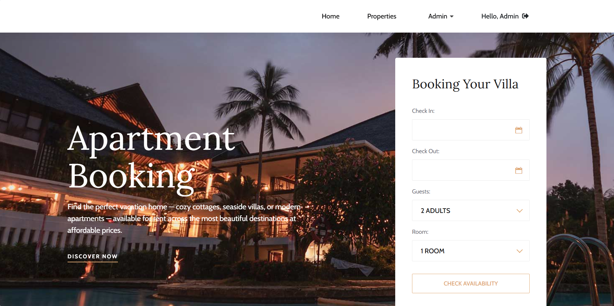
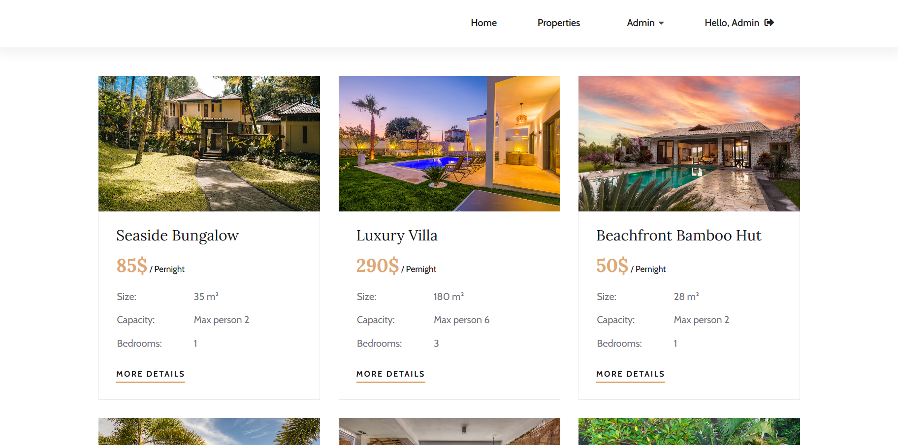
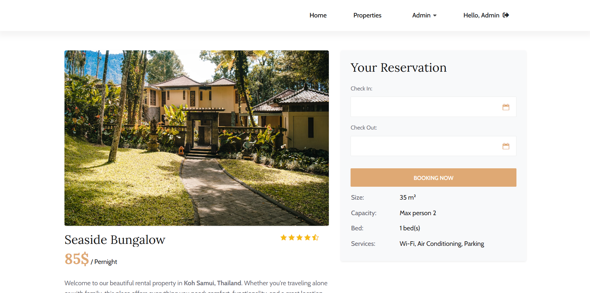
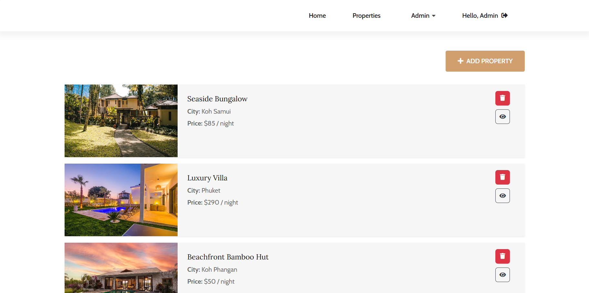
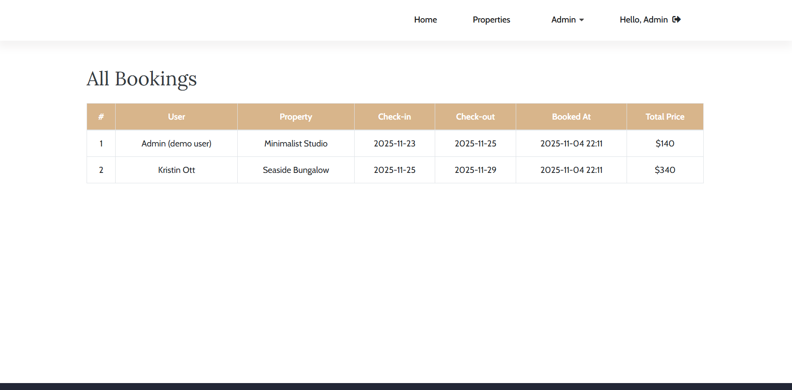

# 🏡 ApartmentBookingApp
**Full-stack ASP.NET Core 8 microservice system for apartment booking.**  
A production-style solution demonstrating authentication, caching, service communication, and clean modular architecture.

---

## 🔗 Solution Structure
| Project | Type | Description |
|----------|------|-------------|
| **AuthAPI** | Web API | Manages user authentication, registration, JWT & refresh tokens |
| **BookingAPI** | Web API | Handles apartments, bookings, validation, caching, and API logic |
| **Frontend** | MVC App | Provides user interface, authentication flow, and admin dashboard |

---

## 🔗 Technologies & Libraries

| Layer | Technologies |
|-------|---------------|
| **Frontend (MVC)** | ASP.NET Core MVC, Serilog (File), Polly, Custom Exception Filter (`AuthRedirectExceptionFilter`), Bootstrap theme |
| **BookingAPI** | ASP.NET Core WebAPI, EF Core (SQL Server), AutoMapper, FluentValidation, Serilog (File), JwtBearer Auth, Swagger, ResponseCaching, Custom Exception Middleware |
| **AuthAPI** | ASP.NET Core WebAPI, EF Core (SQL Server), AutoMapper, FluentValidation, Serilog (File), JwtBearer Auth, Swagger, Custom Exception Middleware |

---

## 🧩 Architecture Highlights

- Clean modular structure (Controllers, Services, Validators, Middleware, Extensions, DTOs)
- Independent APIs communicating via `HttpClient`
- JWT Authentication with Access + Refresh tokens
- Role-based authorization (`Admin`, `Guest`)
- Automatic token renewal in frontend
- Centralized error handling (`ExceptionHandlerMiddleware`)
- Unified API response format (`ApiResponseDto`, `AuthResponseDto`)
- Response caching for GET endpoints
- Logging pipeline using **Serilog**
- Fault tolerance and retry policies via **Polly**
- Custom filters for 401/403 redirection
- Bootstrap UI for frontend presentation

---

## 👤 Demo Users
| Role | Email | Password |
|------|--------|-----------|
| Admin | `admin@demo.com` | `Admin123!` |
| Guest | `user@demo.com` | `User123!` |

All new registered users automatically receive the **Guest** role.

---

## 🧱 Core Components

### 🖥️ Frontend (MVC)
- Cookie-based authentication + JWT management  
- Auto-refresh of tokens on expiration  
- `AuthRedirectExceptionFilter` for handling unauthorized responses  
- Admin dropdown with restricted pages  
- Booking form for authenticated users  
- Simple, elegant Bootstrap-based layout  

### 🧾 BookingAPI
- CRUD operations for apartments and bookings  
- Response caching for performance  
- Centralized exception middleware  
- Serilog logging for all layers  
- FluentValidation for request validation  
- AutoMapper for DTO mapping  

### 🔐 AuthAPI
- JWT + Refresh Token handling  
- User registration, login, and token refresh endpoints  
- FluentValidation and AutoMapper integration  
- Exception middleware and structured logging  

---

## 🔗 API Communication

| Caller | Callee | Auth | Description |
|--------|---------|------|-------------|
| Frontend | AuthAPI | ✅ JWT | Authentication, token refresh, registration |
| Frontend | BookingAPI | ✅ JWT / ❌ Public | Apartments and bookings endpoints |

---

## 🖼️ Screenshots

### 🏠 Home Page


### 🏘️ Properties List


### 🏡 Property Details


### 📅 Admin Panel — Properties


### 📅 Admin Panel — Bookings


---

## 🚀 How to Run Locally

1. Clone the repository  
   ```bash
   git clone https://github.com/nadiya-pl/ApartmentBookingApp.git
   ```

2. Open solution `ApartmentBookingApp.sln` in Visual Studio.

3. Set **Frontend** as the startup project (or configure multiple startup projects for APIs).

4. Update connection strings in each API’s `appsettings.json` to point to your SQL Server instance.

5. Apply database migrations:
   ```bash
   dotnet ef database update --project AuthAPI
   dotnet ef database update --project BookingAPI
   ```

6. Run the solution.  
   Frontend will be available at `https://localhost:xxxx`.

---

## 🧾 Example API Response

```json
{
  "success": true,
  "data": {
    "id": 1,
    "title": "Sea View Apartment",
    "pricePerNight": 120
  }
}
```

---

## 🧠 Summary
**ApartmentBookingApp** demonstrates production-level practices in ASP.NET Core 8:

- Microservice communication via HttpClient  
- JWT authentication with refresh tokens  
- Role-based authorization  
- Structured logging via Serilog  
- Resilience and retry policies using Polly  
- Response caching for performance  
- Exception handling middleware and validation layers  
- Clean, modular, and maintainable architecture  


📫 [LinkedIn](https://www.linkedin.com/in/nadiya-pl) • [GitHub](https://github.com/nadiya-pl)
